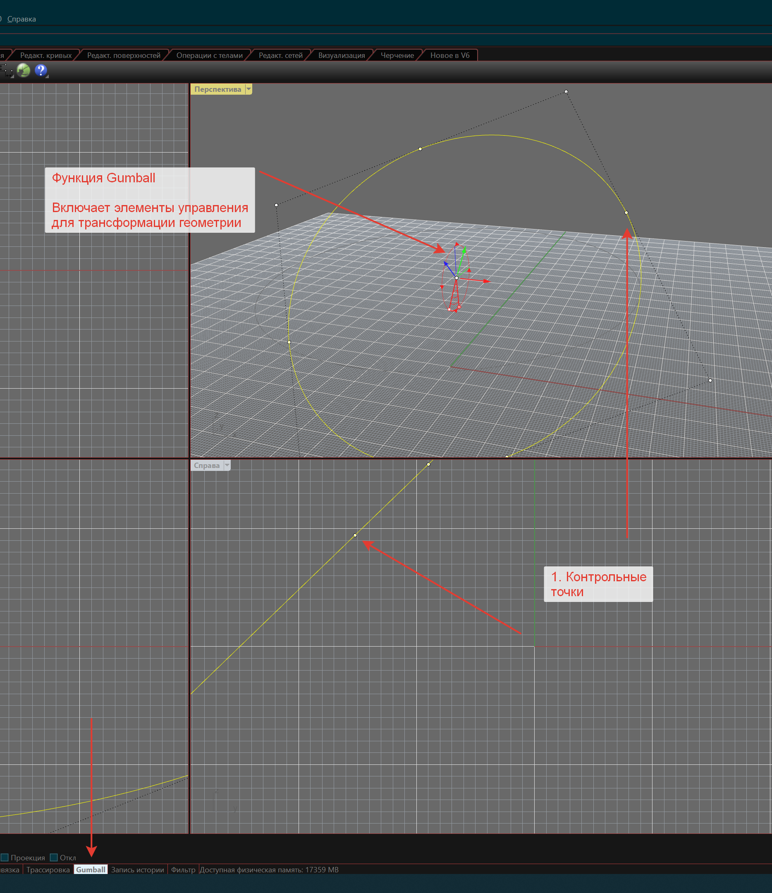

# 1.3. Основы моделирования в Rhinoceros

## **Шаг 01.03.02.V.** Интерфейс Rhino 6




Порядок ввода команд схож с AutoCAD: вводится команда - через **консоль** или по кнопке, далее выбираем действия и/или модификаторы в **командной строке**

## **Шаг 01.03.03.T.** Интерфейс Rhino 6

Подробнее об интерфейсе Rhino 6 можно [узнать из справки](http://docs.mcneel.com/rhino/5/help/en-us/index.htm#user_interface/rhino_window.htm), ниже мы также предлагаем свою схему основных панелей интерфейса:


1 - окно с историей команд, здесь можно просмотреть ранее активированные команды в рамках текущей рабочей сессии.

2 - командная строка, если вы знаете название команды, то можете вбить её в эту строку, и она будет запущена, также через командную строку доступны опции команд.

3 - панели инструментов \(верхняя и боковая\), на верхней панели присутствуют тематические вкладки, каждая из которых обладает своим набором инструментов.

4 - видовые экраны \(viewports\), демонстрируют модель с того или иного ракурса.

5 - переключатель видов, актуален, когда один из экранов развернут полностью или когда видов больше, чем видовых экранов.

6 - панель привязок, здесь просто можно включать и выключать привязки.

7 - панель режимов, отсюда активируются специальные режимы интерфейса и построения геометрии, например, режим Planar позволяет строить исключительно планарные кривые.

8 - название вида и выпадающее меню с командами управления видом, например, через это меню можно поменять режим отображения вида \(для картинки выше мы поставили режим Artistic\).

9 - дополнительные панели, например, панель Properties \(показывает свойства выделенного объекта\), панель Layers \(позволяет управлять слоями\), панель Help \(выводит справку\), панель Display \(отвечает за параметры вида, такие как фон, тени и другие\) ...

10 - выпадающие меню, здесь продублированы команды с панели инструментов, но они структурированы в списки.

## **Шаг 01.03.04.V.** Типы геометрии

### Точка

Таймкод - 00:00

Точку можно построить через одноимённую команду Point в Rhino

```python
import rhinoscriptsyntax as rs
import ghpythonlib.components as gh
import Grasshopper as g
import sys

ghcompfolder = g.Folders.DefaultUserObjectFolder
if ghcompfolder not in sys.path:
    sys.path.append(ghcompfolder)

# Создаст точку с координатой 0, 0, 0 
# В качестве аргументом принимает <int>, <float>
point = rs.AddPoint(0, 0, 0)

print(type(point))
```

```python
OUT: >>> <type 'Guid'>
```

Тип 'Guid' подходит для промежуточной обработки данных. В этом случае они обрабатываются по уникальному [GUID](https://ru.wikipedia.org/wiki/GUID). Если нужна геометрия нескольких точек для дальнейшей обработки или необходимо получить координаты - точку необходимо сконвертировать в 'Point3d'

```python
# Преобразует точку Rhino в точку Grashopper
point = rs.coerce3dpoint(point)

print(type(point))
```

```python
OUT: >>> <type 'Point3d'>
```

### Полилиния

Таймкод - 01:11

## **Шаг 01.03.05.Q.** Задача на понимание типов геометрии

## **Шаг 01.03.06.V.** NURBS кривые

## **Шаг 01.03.07.V.** NURBS поверхности, часть 1

## **Шаг 01.03.08.V.** NURBS поверхности, часть 2

## **Шаг 01.03.09.V.** Mesh поверхности

